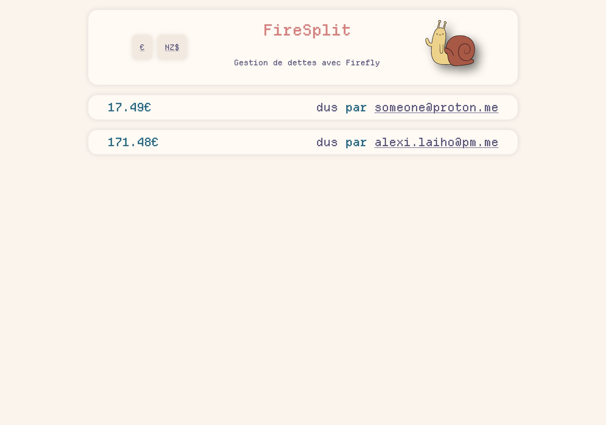
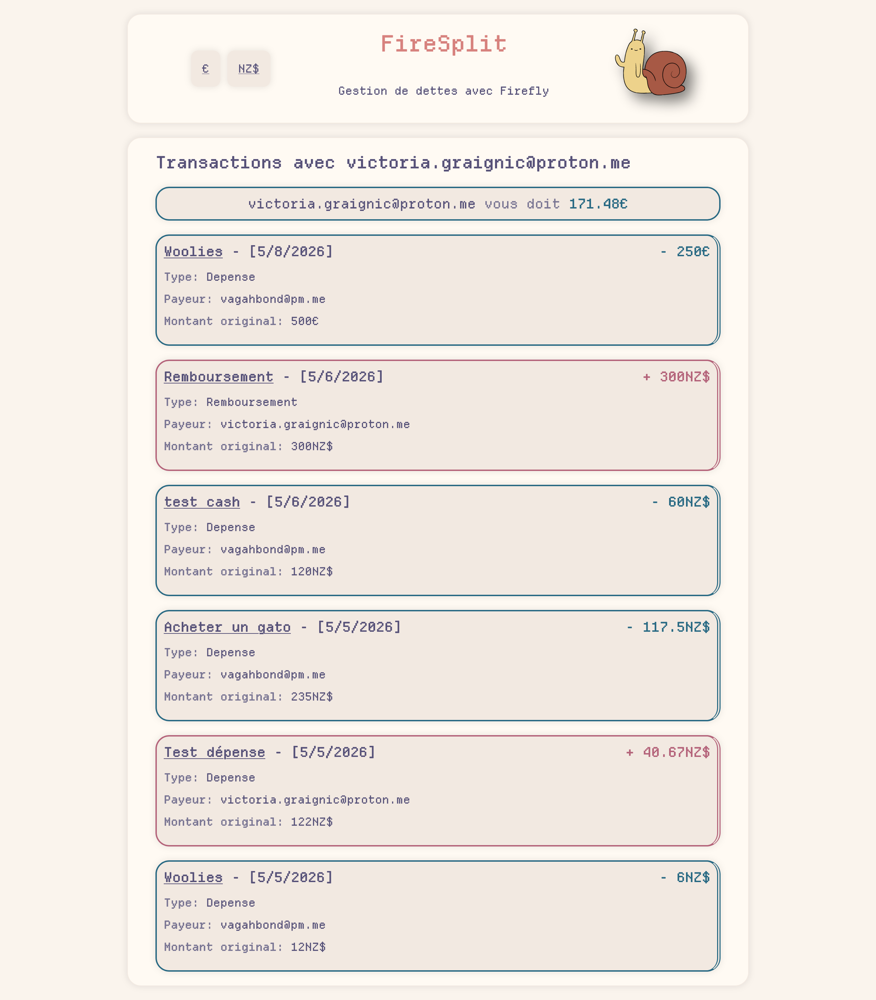

# Firesplit
A [Firefly III](https://https://www.firefly-iii.org/) companion app to track your shared expenses with your mates and family. 

## Why ? 
Firefly III is a great financial tracker, but it lacks the transactions sharing features. 

Firesplit allows counting your expenses without having to manually import them in a second app, which is way too much work if you're tracking regular expenses as a couple. 

For personnal reasons, I also included a feature to take several currencies into account.
## How ?
Firesplit is a **very** simple and minimal app. It is basically a [Bun](https://bun.sh/) app, with a [Pug](https://pugjs.org/) frontend.

It connects right to Firefly III's database and queries transactions to show you balances and reports. 
Of course, it is read-only, you can be sure it won't mess up your finances. 

## How to use it ?

### Installation

Import this flake in your nixos configuration: 

```nix
{
  inputs = {
    nixpkgs.url = "github:NixOS/nixpkgs/nixos-unstable";
    firesplit.url = "github:vagahbond/firesplit";
  };
outputs = {nixpkgs, ...} @ inputs: {
    nixosConfigurations.HOSTNAME = nixpkgs.lib.nixosSystem {
      specialArgs = { inherit inputs; }; # this is the important part
      modules = [
        ({pkgs, ...}: {
            # Import the module
            imports = [
              inputs.firesplit.nixosModules.default
            ];
            # Enable Firesplit along with Firefly III
            services.firefly-iii.firesplit.enable = true;
          })
      ];
    };
  };
}
```
Or simply clone the repo and run it with bun in your own preferred fashion.

If anyone is interested I can give you a dockerfile along with the docker-compose example.

### Usage

#### Transactions
If you paid for something that benefits you and your mate, you he then owes you half of the amount.
If it was with 2 mates, then each of them owes you a third of the amount.

When that happened, simply register your transaction as you would any other in Firefly III. 
Then mark it with a tag that starts with `shared:` followed by the email of the person you're sharing with.

For example, if you're sharing with `john@example.com`, you would tag your transaction with `shared:john@example.com`.

With the e-mail being the one that person uses on your Firefly III instance, of course. 

#### Reimbursements 
If you want to pay your mate back, then you are going to create an expense in Firefly III, with the receiving account named with your friend's e-mail. 
No need to tag on this one, it will be automatically detected by Firesplit.

#### Retroactive balances
Firesplit is basically querying all of your transactions via bespoke SQL queries everytime you display the balances. 
Not the most efficient or scalable way to do it, but don't lie: How many users do you have heh ? 

If it gets slow for me after thousands of transactionsm I will definitely optimize it. 

### Interfaces 

The interface is super duper simple. 

The header leads you back to the main page, and allows you to switch currencies.

> Note: The interface has been made in french, but I could add a language switcher if anyone asked for it.

#### Balances 

A list of the balances with anyone that has had a shared transaction with you. 


#### Reports 

A list of the transactions that you have shared with someone. 



# Considerations 
I do not have the time to dig into it for now, but some calculations are approximate, and debts estimations may vary 1 or 2 dollars after calculation and translation between different currencies. 

Depending on your setup , you might have skewed rates between currencies registered in your Firefly app too. 

Personally, I intend to update it via n8n automation.

I decided to live with the small incorrectness of the calculations.


Don't rely on this app if your mates or family members are cheapskates.

And thank you Javascript for messing up float calculations.

